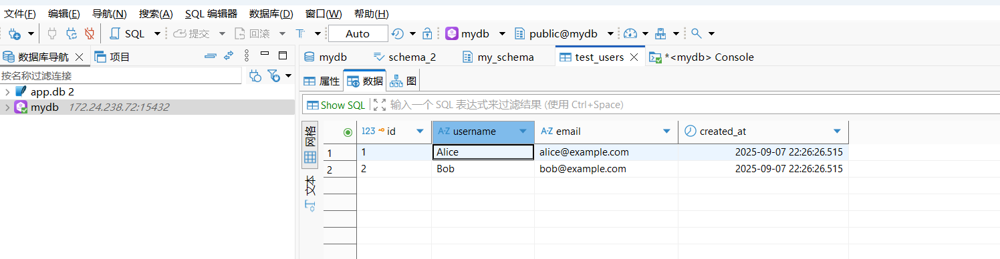

## WSL Docker安装opengauss


使用官方镜像创建opengauss

```bash
docker run --name opengauss --privileged=true -d -e GS_DBNAME=mydb -e GS_USERNAME=omm  -e GS_PASSWORD=Enmo@123 -p 15432:5432 -v opengauss:/var/lib/opengauss opengauss/opengauss:5.0.0

# 将主机当前目录下的opengauss挂载到容器的`/var/lib/opengauss`目录
```


查看日志，获取用户名与密码

```bash
 docker logs opengauss |grep user
```

一般容器初始化时实际创建的用户是 `opengauss`或者 `gaussdb`， `omm`这个用户由于安全原因无法直接使用，需要单独再创建一个用户，比如`mxh_user`.


进入容器后查看设置环境变量，执行gsql：

```bash
docker exec -it opengauss bash

#!/bin/bash
export GAUSSHOME=/usr/local/opengauss
export PATH=$GAUSSHOME/bin:$PATH
export LD_LIBRARY_PATH=$GAUSSHOME/lib:$LD_LIBRARY_PATH
export PGHOST=/tmp
export PGPORT=5432

# 使用opengauss登录
gsql -d postgres -U opengauss -W 'Enmo@123'
# 或者使用gaussdb登录
gsql -d postgres -U gaussdb -W 'Enmo@123'
```


进入数据库后可以给数据库添加新的用户了以及添加数据库了：

```sql
# 步骤1：创建mydb数据库(如果没有的话，上面实际上已经创建过数据库了)
gsql -d postgres -U gaussdb -W 'Enmo@123'
CREATE DATABASE mydb OWNER mxh_user;

# 步骤 2：在 gsql 中创建新用户mxh_user并授权
-- 1. 创建用户（密码必须复杂）
CREATE USER mxh_user WITH PASSWORD 'Gauss@123';

-- 2. 授予登录权限
ALTER USER mxh_user WITH LOGIN;

-- 3. 授予CONNECT与CREATE数据库的权限
GRANT CONNECT ON DATABASE mydb TO mxh_user;
GRANT CREATE ON DATABASE mydb TO mxh_user;

-- 4. 授予 public 模式 usage与create 权限
GRANT USAGE ON SCHEMA public TO mxh_user;
GRANT CREATE ON SCHEMA public TO mxh_user;

-- 5. 授予对所有现有表的读写权限
GRANT SELECT, INSERT, UPDATE, DELETE ON ALL TABLES IN SCHEMA public TO mxh_user;

-- 6. 设置默认权限（以后创建的表也自动授权）
ALTER DEFAULT PRIVILEGES IN SCHEMA public GRANT SELECT, INSERT, UPDATE, DELETE ON TABLES TO mxh_user;
```


此时，也可以使用Dbeaver登录数据库了，需要注意的使，WSL2的网卡与Windows的并不是同一个。如在Windows上无线局域网适配器 WLAN网卡地址为192.168.136.111，WSL的虚拟网卡地址为172.24.224.1，

```bash
⎈ ➔  ipconfig.exe

Windows IP 配置

无线局域网适配器 WLAN:

   连接特定的 DNS 后缀 . . . . . . . : pnp.gw
   IPv4 地址 . . . . . . . . . . . . : 192.168.136.111
   子网掩码  . . . . . . . . . . . . : 255.255.224.0
   默认网关. . . . . . . . . . . . . : 192.168.128.1


以太网适配器 vEthernet (Default Switch):

   连接特定的 DNS 后缀 . . . . . . . :
   IPv4 地址 . . . . . . . . . . . . : 172.18.48.1
   子网掩码  . . . . . . . . . . . . : 255.255.240.0
   默认网关. . . . . . . . . . . . . :

以太网适配器 vEthernet (WSL (Hyper-V firewall)):

   连接特定的 DNS 后缀 . . . . . . . :
   IPv4 地址 . . . . . . . . . . . . : 172.24.224.1
   子网掩码  . . . . . . . . . . . . : 255.255.240.0
   默认网关. . . . . . . . . . . . . :
```

而在WSL2中系统地址如下为`172.24.238.72`：

```bash
laomei@wsl:~$ ifconfig
docker0: flags=4099<UP,BROADCAST,MULTICAST>  mtu 1500
        inet 172.17.0.1  netmask 255.255.0.0  broadcast 172.17.255.255
        ether 96:a3:2c:26:26:bc  txqueuelen 0  (Ethernet)
        RX packets 0  bytes 0 (0.0 B)
        RX errors 0  dropped 0  overruns 0  frame 0
        TX packets 0  bytes 0 (0.0 B)
        TX errors 0  dropped 0 overruns 0  carrier 0  collisions 0

eth0: flags=4163<UP,BROADCAST,RUNNING,MULTICAST>  mtu 1500
        inet 172.24.238.72  netmask 255.255.240.0  broadcast 172.24.239.255
        inet6 fe80::215:5dff:fe64:c2be  prefixlen 64  scopeid 0x20<link>
        ether 00:15:5d:64:c2:be  txqueuelen 1000  (Ethernet)
        RX packets 2  bytes 132 (132.0 B)
        RX errors 0  dropped 0  overruns 0  frame 0
        TX packets 8  bytes 648 (648.0 B)
        TX errors 0  dropped 0 overruns 0  carrier 0  collisions 0

lo: flags=73<UP,LOOPBACK,RUNNING>  mtu 65536
        inet 127.0.0.1  netmask 255.0.0.0
        inet6 ::1  prefixlen 128  scopeid 0x10<host>
        loop  txqueuelen 1000  (Local Loopback)
        RX packets 4  bytes 388 (388.0 B)
        RX errors 0  dropped 0  overruns 0  frame 0
        TX packets 4  bytes 388 (388.0 B)
        TX errors 0  dropped 0 overruns 0  carrier 0  collisions 0
```

所以，我们在Windows上访问Docker暴露的服务均应该为WSL2中的eth0的地址，即`172.24.238.72`. 启动Docker后在外部使用DBeaver访问：

```bash
laomei@wsl:~$ docker ps -a
CONTAINER ID   IMAGE                       COMMAND                  CREATED          STATUS                       PORTS                                           NAMES
6690e70eafc6   opengauss/opengauss:5.0.0   "/var/lib/opengauss/…"   43 minutes ago   Exited (255) 2 minutes ago   0.0.0.0:15432->5432/tcp, [::]:15432->5432/tcp   opengauss

laomei@wsl:~$ docker start  opengauss
opengauss
laomei@wsl:~$ docker ps -a
CONTAINER ID   IMAGE                       COMMAND                  CREATED          STATUS                   PORTS                                           NAMES
6690e70eafc6   opengauss/opengauss:5.0.0   "/var/lib/opengauss/…"   44 minutes ago   Up 5 seconds             0.0.0.0:15432->5432/tcp, [::]:15432->5432/tcp   opengauss
```


在DBeaver上测试一下：

```sql
-- 1. 创建专属 schema（避免使用 public）
CREATE SCHEMA my_schema AUTHORIZATION mxh_user;

-- 2. 创建用户表(指定schema)
CREATE TABLE my_schema.test_users (
  id SERIAL PRIMARY KEY,
  username VARCHAR(50) NOT NULL,
  email VARCHAR(100) UNIQUE,
  created_at TIMESTAMP DEFAULT CURRENT_TIMESTAMP
);

-- 3.插入测试数据
INSERT INTO my_schema.test_users (username, email) VALUES 
  ('Alice', 'alice@example.com'),
  ('Bob', 'bob@example.com');

-- 4.验证数据
SELECT * FROM test_users;

```

查看数据信息：


